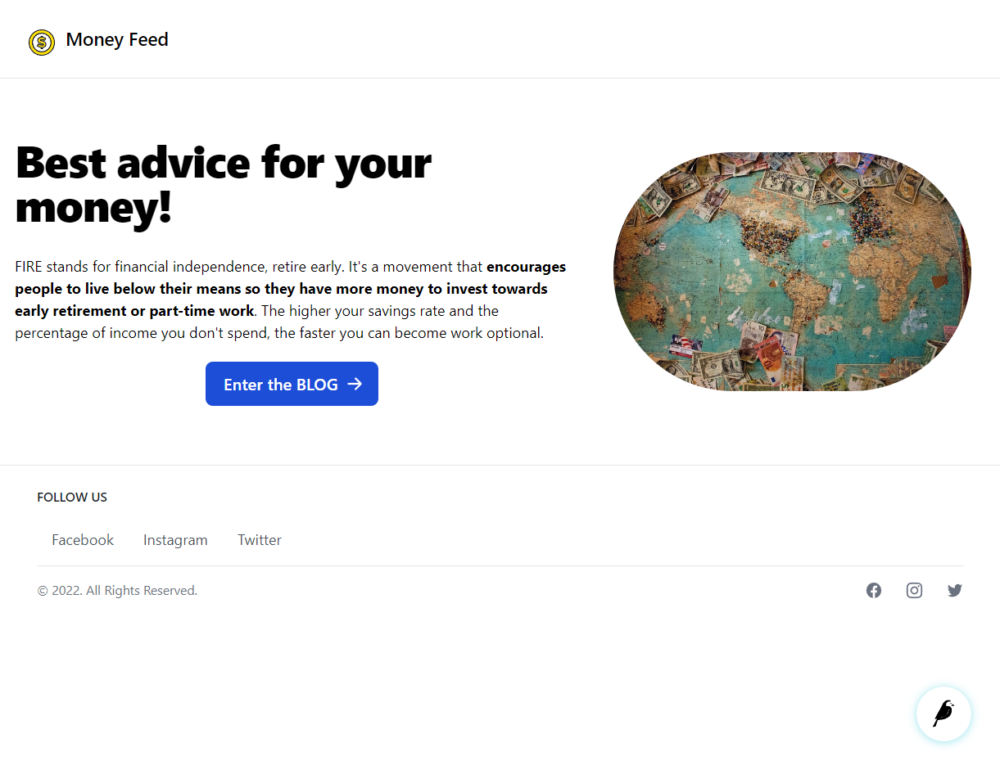
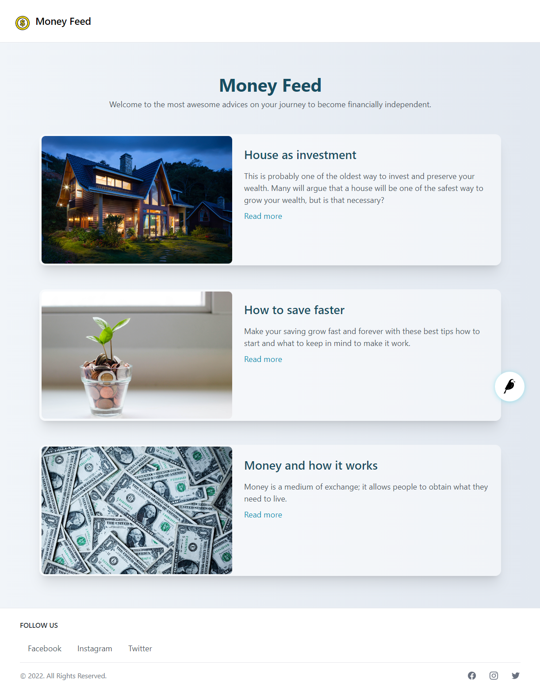
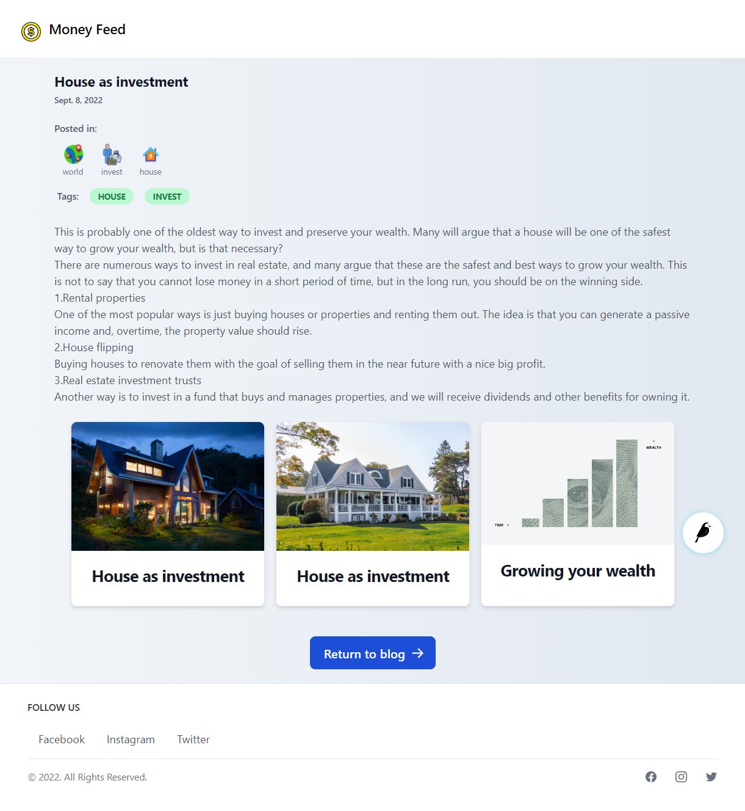
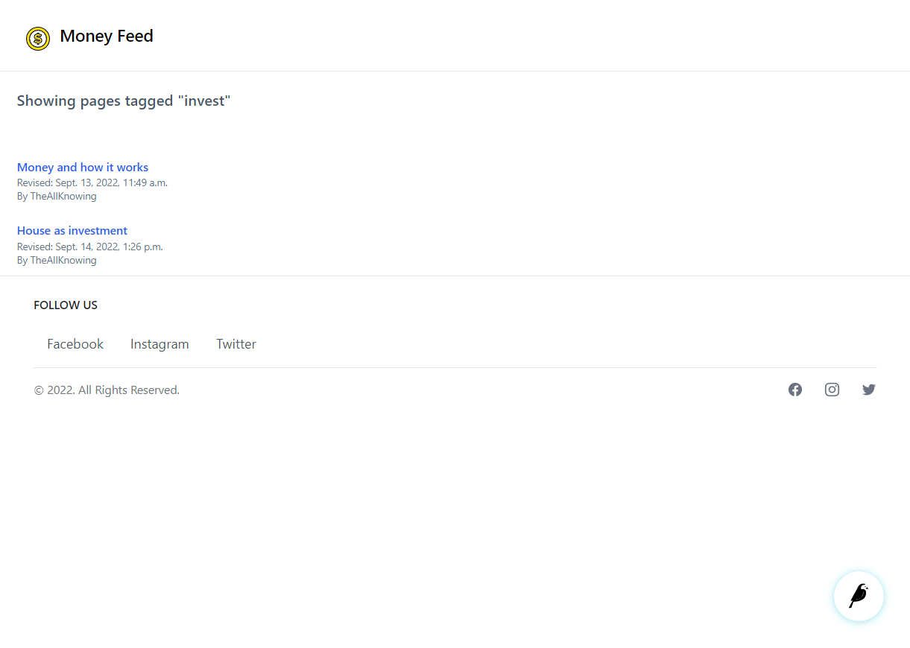

# Financial_Blog_Wagtail_CMS

This is a responsive website that represents a financial blog where the owner can easily manage the content with the wagtail framework. Wagtail is an open source CMS written in Python and built on the Django framework.
It offers a fast and attractive interface for editors where content can be created and structured intuitively.
The websites consist of a homepage where the user can enter the blog.
On the main page of the blog, the user has an overview of all the posts listed chronologically.
Each post also has a detailed view where the whole content is shown with additional information like categories, tags, author, date posted, main content of the post, and gallery.
For every post, the user can add tags and customise categories.
The user also has the option of choosing a specific tag and displaying all the posts on the blog related to that specific tag. Categories and profiles need to be edited or created before they can be connected to a specific post or article.
On the settings site there is also configuration prepared for linking the blog website with other social media websites. Currently active are Facebook, Twitter, and Instagram, but this can be easily added with the use of the added app_site_settings where all the social media links are configured.
The focus of this website is on the content management of a financial blog, which can be easily edited from the admin site provided by Wagtail. 

---

 
In order to run the website:  
1. Change the name of .env.example to .env and add your DJANGO_SECRET_KEY for your website.  
2. navigate to the main directory, which contains the entire project.  
3. python -m venv ENV - create a virtula enviromet.  
4. pip install -r requirements.txt - install all the required Python libraries.  
5. python manage.py migrate - execute your first migration command.  
6. python manage.py createsuperuser - create a super user for your project.  
7. python manage.py runserver - start your server, which will allow you to access your website via a web browser at localhost: 8000.  
 

---

 

**Created with  Wagtail 4.0, Django 4.1, Python 3.10.6, Flowbite, Tailwind CSS, CSS, HTML.**
 

 
Wagtail 4.0 
https://wagtail.org/  

Django 4.1  
https://www.djangoproject.com/  

Flowbite 
https://flowbite.com/  

Tailwind CSS  
https://tailwindcss.com/  

---

### Website views:
 

1. Home page 
http://localhost:8000/ 
2. Main blog view  
http://localhost:8000/blog/ 
3. Detail post view 
http://localhost:8000/blog/house-as-investment/ 
4. Tag specific view 
http://localhost:8000/tags/?tag=invest 

 
1. Home page:
 

 

---

2. Main blog view:
 

 

---

3. Detail post view:
 

 

---

4. Tag specific view:
 

